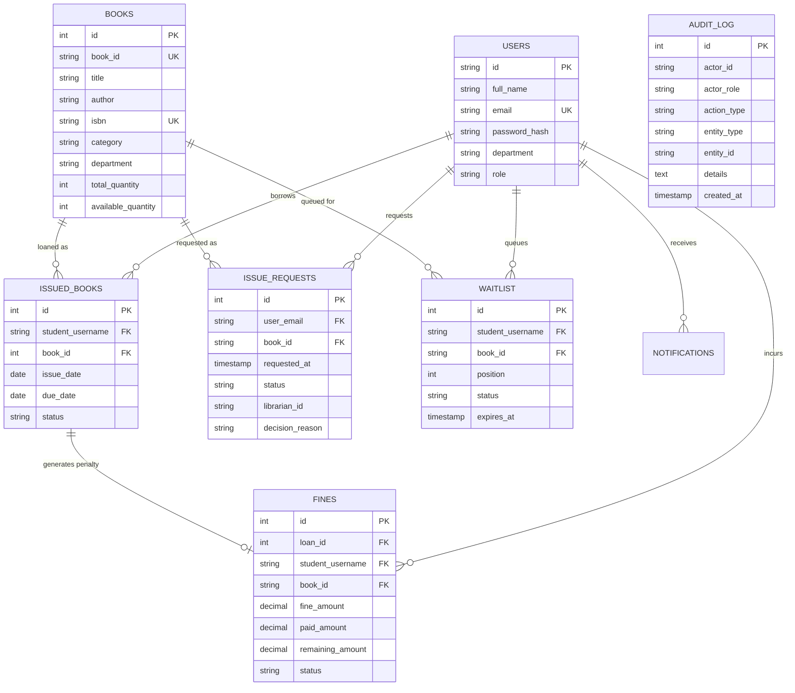

# Database Schema & Normalization Documentation (MMCOE Library)

## 1. Entity-Relationship Diagram (ERD)

---

## 2. Database Normalization Analysis (1NF ➔ 3NF)

### 1️⃣ First Normal Form (1NF)
- All columns contain atomic, non-divisible scalar values.
- Repeating groups and multi-valued attributes (such as array strings for books) were eliminated by decoupling into distinct entity tables (`users`, `books`, `issued_books`, `waitlist`, `fines`).
- Every table has a clearly defined Primary Key (`PK`).

### 2️⃣ Second Normal Form (2NF)
- All non-key attributes are fully functionally dependent on the entire Primary Key.
- Partial dependencies were removed:
  - Book metadata (`title`, `author`, `isbn`, `rack_number`) is stored solely in `books`.
  - Loan lifecycle events reference `books(id)` via Foreign Keys rather than repeating title/author attributes across transaction tables.

### 3️⃣ Third Normal Form (3NF)
- Transitive dependencies (`A -> B` and `B -> C`) were eliminated.
- User details (`full_name`, `department`, `role`) are dependent solely on `users.id`, not duplicated inside transaction rows (`issued_books`, `fines`, `waitlist`).
- Fine rate metrics (`fine_rate_per_day = ₹6.00`) and remaining balances (`remaining_amount = fine_amount - paid_amount`) are explicitly isolated to prevent anomaly cascades.
